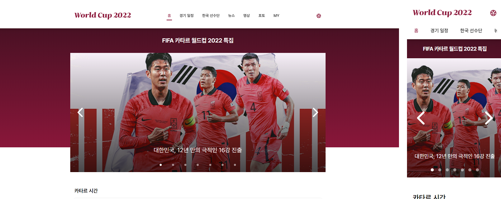
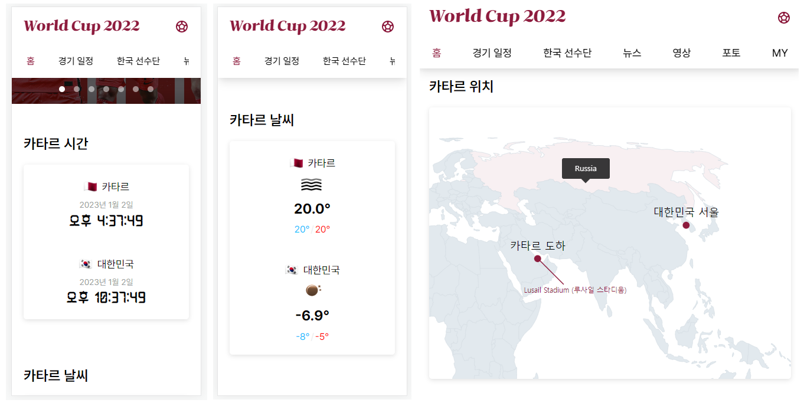
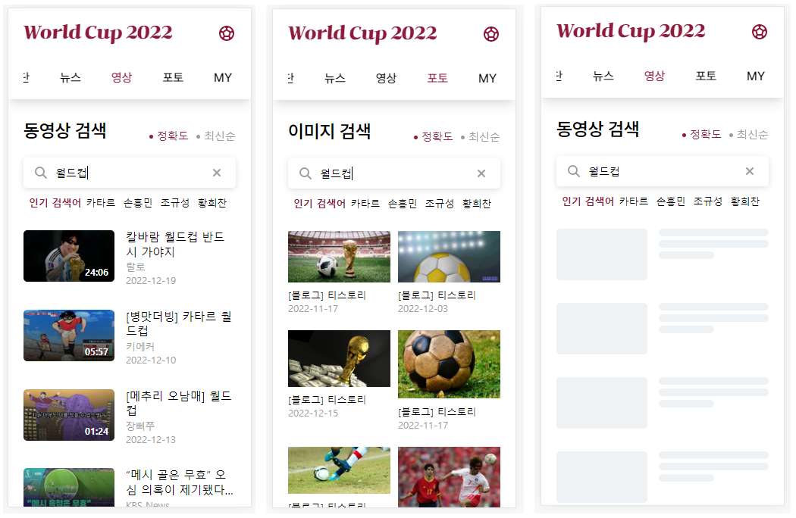
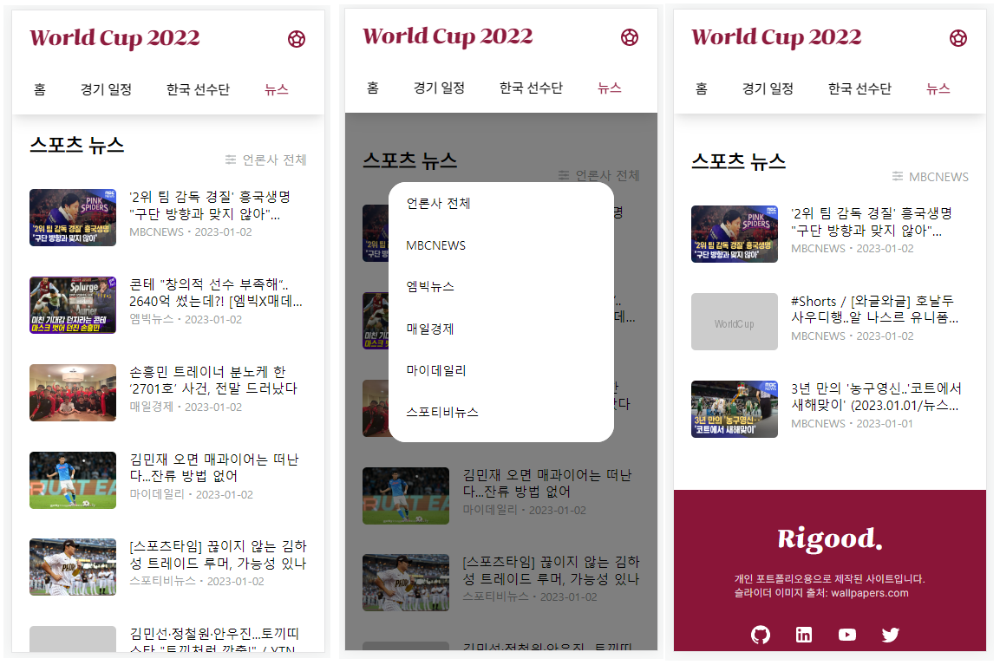
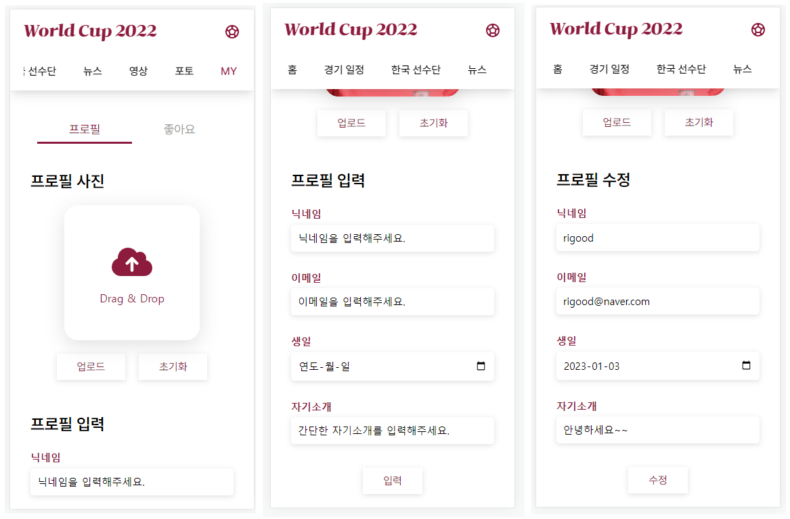

# Worldcup 2022

- 네이버 카타르 월드컵 페이지에 착안하여, `월드컵 관련 각종 정보를 조회할 수 있는 서비스` 제작
- [Demo 바로가기](https://rigood.github.io/worldcup2022)

 

## 💻 프로젝트

- 프론트엔드에서 자주 사용하는 UI 및 기능 구현을 연습하기 위한 프로젝트
- 2022년 12월 (개인 프로젝트)

 

## 📌 UI/UX 및 주요 기능

- `반응형 디자인` 적용

  

 

- 탭 메뉴 및 콘텐츠에 `슬라이더` 도입

  

 

- 무한 슬라이드
- PC에서는 드래그, 모바일에서는 터치를 통해 슬라이더 이동
- 화살표 버튼, 페이지네이션을 통해 원하는 지점으로 이동 가능

 

- `날씨 API`, `지도 라이브러리`를 사용

  

  - 실시간 날씨 정보 표시
  - 지도에 마커 및 주석으로 위치 표시
  - 지도 위에 마우스 hover 시 해당 국가명을 tooltip으로 표시

 

- `월드컵 API`를 통해 일자별 경기 결과 표시

  - `※ 로컬 환경에서만 사용 가능`
  - 상단에 일자별 탭 메뉴를 클릭하면 해당 일자 경기 결과 위치로 이동
  - `Intersection Observer API`를 사용하여 스크롤 위치에 따라 일자별 탭 메뉴 활성화

 

- `카카오 API`를 통한 동영상, 이미지 검색

  

  - 페이지 진입 시 '월드컵'에 대한 검색 결과 표시
  - 월드컵 관련 인기 검색어 리스트 제공
  - 사용자가 원하는 검색어를 입력하여 검색 가능
  - 실시간으로 검색 결과 제공
  - 검색 결과를 `정확도순, 최신순으로 정렬` 가능
  - 무한 스크롤을 통해 데이터 제공
  - 데이터 로딩 시 `Skeleton UI` 표시

 

- `News API`를 이용하여 한국 스포츠 뉴스 제공

  

  - `※ 로컬 환경에서만 사용 가능`
  - 더보기 버튼 클릭 시 추가 데이터 제공
  - `언론사별로 기사 필터링` 가능
  - 데이터 로딩 시 Skeleton UI 표시

 

- 프로필 사진 및 정보 입력

  

  - `드래그 앤 드롭` 또는 파일 열기 방식을 통해 프로필 사진 업로드
  - 업로드된 사진과 정보는 `LocalStorage`에 저장
  - 프로필 수정 기능

 

## 🔍 구현 방법

- 슬라이더

  - 별도 라이브러리 없이 `순수 자바스크립트`로 구현
  - mouse, touch 이벤트를 감지하여 사용자가 움직인 좌표만큼 scrollLeft 값 변경

- API 비동기 통신

  - 카카오 API는 `axios` 라이브러리, News API는 `fetch API` 사용

    - 카카오 동영상/이미지 검색은 검색어·정렬 조건이 변경되거나 추가 페이지를 불러올 때  
      parameter를 변경하여 api 요청을 보내야 하므로, params 옵션을 지원하는 axios 사용

    - 스포츠 뉴스는 데이터 양이 제한되는 무료 API를 사용하므로,  
      초기에 fetch API를 통해 모든 데이터를 수신받고 사용자 요청에 따라  
      filter, slice 메서드를 통해 데이터를 편집하여 제공
    - 비동기 통신 관련 로직을 커스텀 훅으로 분리하여 재사용

  - 실시간 검색 최적화 작업
    - `debounce`를 적용하여 불필요한 API 호출 방지
    - axios의 cancelToken을 사용하여 이전 요청 취소
